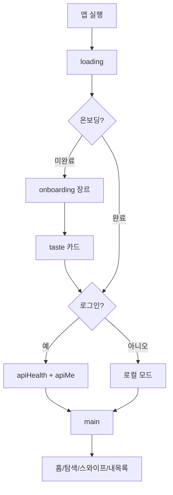

# 사용자 흐름

> **누가 봄**: PM, Designer, FE, QA
> **언제 봄**: 새 기능이 어느 단계에 들어가는지 가늠할 때, 인수 테스트 시나리오 작성할 때
> **함께 봐야 할 문서**: [`요구사항.md`](요구사항.md)

## 첫 부팅 (신규 사용자)

```
앱 실행
  ↓
[loading] 토큰/취향 복원 (~0.3s)
  ↓
[onboarding] 좋아하는 장르 다중 선택 → 다음
  ↓
[taste] 추천 카드 10개 좋아요/패스 → 완료
  ↓
[auth] 로그인 / 회원가입 / 또는 "로컬로 시작" (스킵)
  ↓
[main] 홈 탭 진입 → 피드 로드
```

**소요 시간 목표**: ≤ 90초

## 부팅 (기존 사용자)

### A. 비로그인 (로컬 모드)
```
앱 실행 → loading → main (홈 탭)
                       └ SWR 캐시 → 즉시 콘텐츠
                       └ 백그라운드 갱신
```

### B. 로그인
```
앱 실행 → loading
            ├ 토큰 발견 → apiHealth ping (Railway 깨움)
            ├ apiMe (1h 캐시 → 안 맞으면 호출)
            └ loadPrefs (5분 TTL → 안 맞으면 호출)
          ↓
       main (홈 탭) → 헤더에 ☁ "동기화 중" 배지
```

## 핵심 시나리오

### S1. 좋아할 만한 거 발견
```
1. 메인 → "이거 좋아하니까 (작품 A)" 캐러셀에서 카드 탭
2. 디테일 모달 열림 (배너 즉시 표시, 본문 fetch 중 LoadingBar)
3. "어디서 봐?" 섹션 — 라프텔 우선, 글로벌 OTT
4. 라프텔 탭 → 외부 브라우저 → 라프텔 시청 페이지
```

### S2. 검색 → 좋아요
```
1. 탐색 탭 → 검색창에 "프리렌"
2. 0.35초 debounce 후 검색
3. 결과 영어 즉시 렌더 → 한국어로 swap (synonyms는 즉시 한국명)
4. 결과 카드 탭 → 디테일 모달
5. 시리즈 보는 순서 확인
6. 닫기 → 탐색 탭에서 다시 옆 작품 탭
```

### S3. 스와이프 (취향 학습 강화)
```
1. 스와이프 탭 → 카드 표시
2. 좋아요/패스 (스와이프 또는 버튼)
3. 즉시 다음 카드
4. 큐 5개 이하면 백그라운드 prefetch
5. 좋아요는 로컬 즉시, 백엔드 push는 3초 debounce 후 bulk
```

### S4. 내 목록 → 인사이트 확인
```
1. 내 목록 탭 (좋아요 5개 이상이라 인사이트 카드 노출)
2. "너의 취향" — top 3 장르 + 자주 본 스튜디오 + 평균 점수
3. 정렬을 "점수"로 → 점수 높은 좋아요 먼저
4. 카드 탭 → 디테일 모달 재진입 (L2 캐시 hit → 즉시 표시)
```

### S5. 장르 재선택
```
1. 헤더의 유저 아이콘 → 메뉴
2. "장르 다시 고르기" → onboarding 모드='edit'으로 재진입
3. 완료 → 홈 탭 즉시 갱신 (reloadToken bump)
```

### S6. 로그아웃 → 다른 계정 로그인
```
1. 메뉴 → "로그아웃"
2. flushPending (큐에 남은 swipe 마지막 push)
3. clearLocalUserData (swipes/검색기록/취향 정리)
4. clearAnimeCache + clearSwrCache (다음 사용자 보호)
5. 헤더 "동기화 중" → "로컬 모드"로 변경
6. (사용자가) 다시 로그인 → 새 데이터 동기화
```

## 에지 케이스

| 상황 | 동작 |
|------|------|
| 네트워크 오프라인 | 캐시 표시 + Toast "네트워크 연결을 확인해줘" |
| AniList 429 | Toast "요청이 너무 잦아", 클라 측 동시성 큐로도 방어 |
| Railway 다운 | 헤더 "오프라인" 배지, 로컬 데이터로 동작 |
| DeepL 한도 초과 | 1h 회로 차단 + Google 번역 폴백 |
| 잘못된 JWT | 401 → 토큰 폐기 → 재로그인 유도 (TODO: 자동 처리) |

## 흐름도


